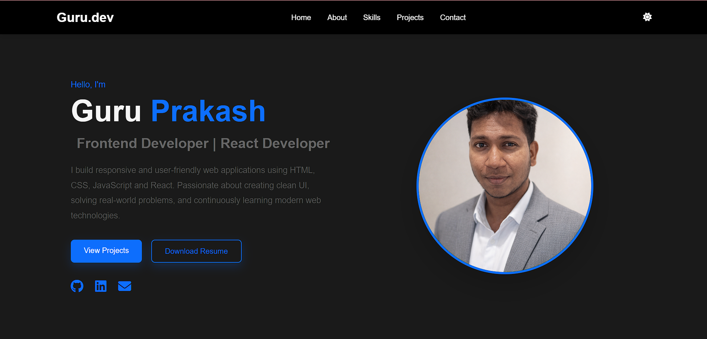
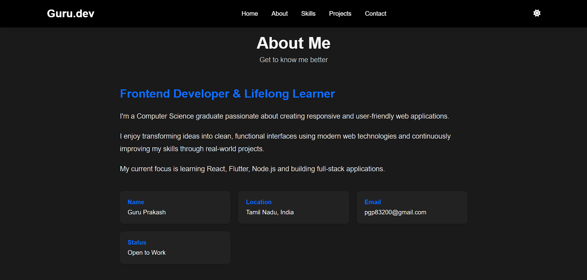
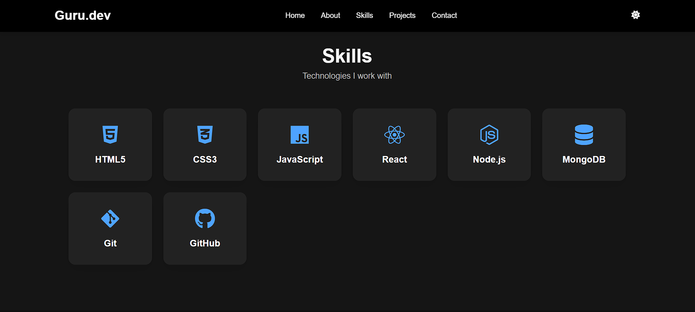
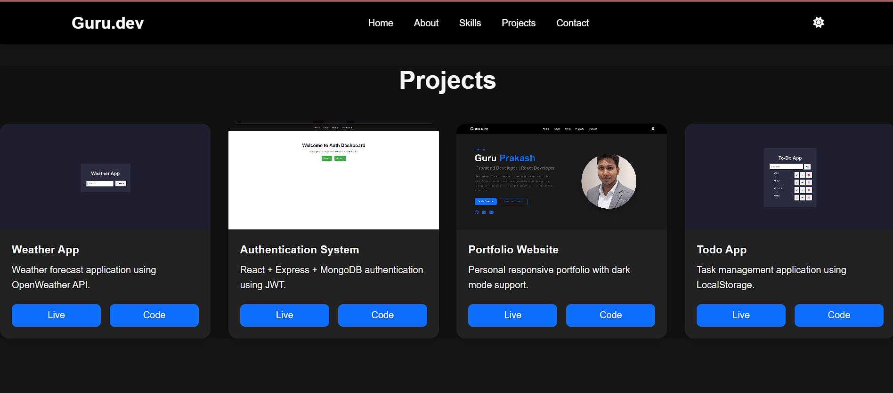
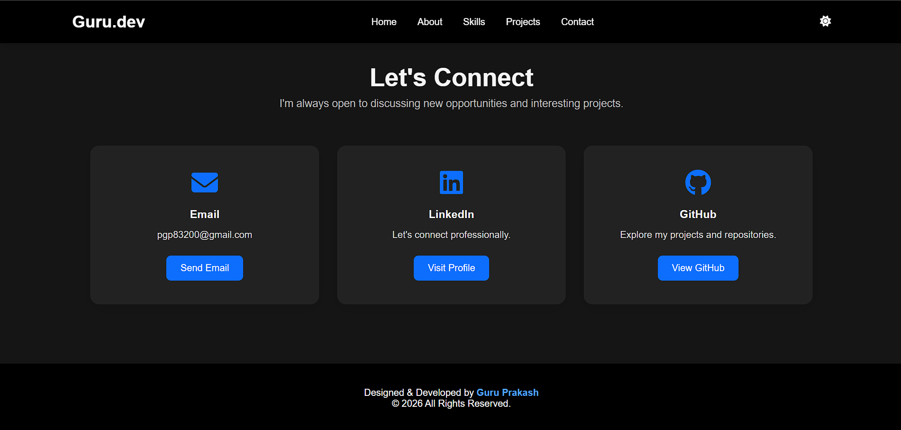

# 🌐 Personal Portfolio Website

A modern and fully responsive **personal portfolio website** showcasing my projects, technical skills, and developer journey. Built with **HTML, CSS, and JavaScript**, the portfolio features a clean user interface, dark mode support, project highlights, and easy access to my GitHub, LinkedIn, and resume.

---

## ✨ Features

- 👋 Modern Hero Section
- 🌙 Light & Dark Theme Toggle
- 📱 Fully Responsive Design
- 👨 About Me Section
- 🛠 Skills Showcase
- 🚀 Featured Project Highlight
- 📂 Project Gallery
- 📸 Interactive Project Image Preview
- 📬 Contact Section
- 🔗 Social Media Links
- ⚡ Smooth Scrolling Navigation

---

## 🛠 Tech Stack

- HTML5
- CSS3
- JavaScript (ES6+)
- Font Awesome
- Responsive Web Design

---

## 🌐 Live Demo

👉 **https://guruio.github.io/portfolio/**

---

## 📸 Screenshots

### 🏠 Home



---

### 👨 About



---

### 🛠 Skills



---

### 🚀 Projects



---

### 📬 Contact



---

## 📦 Installation

Clone the repository:

```bash
git clone https://github.com/Guruio/portfolio.git
```

Navigate into the project folder:

```bash
cd portfolio
```

Open the project using your preferred editor and launch **index.html** in your browser, or use the **Live Server** extension in VS Code.

---

## 📂 Project Structure

```text
portfolio/
│
├── assets/
├── screenshots/
├── index.html
├── style.css
├── script.js
└── README.md
```

---

## 🔮 Future Improvements

- ⚛ Migrate to React
- 🎬 Improved Project Showcase
- 📊 Skills Progress Indicators
- 📄 Downloadable Resume Preview
- 🌍 Multi-language Support
- 🎨 Additional Animations
- 📝 Blog Section
- 📈 Visitor Analytics

---

## 👨‍💻 Author

**Guru Prakash**

🌐 Portfolio  
https://guruio.github.io/portfolio/

🐙 GitHub  
https://github.com/Guruio

💼 LinkedIn  
https://linkedin.com/in/guru-prakash-59833930a/

📧 Email  
pgp83200@gmail.com

---

## ⭐ If you like this project

If you found this project helpful or interesting, consider giving it a ⭐ on GitHub!
